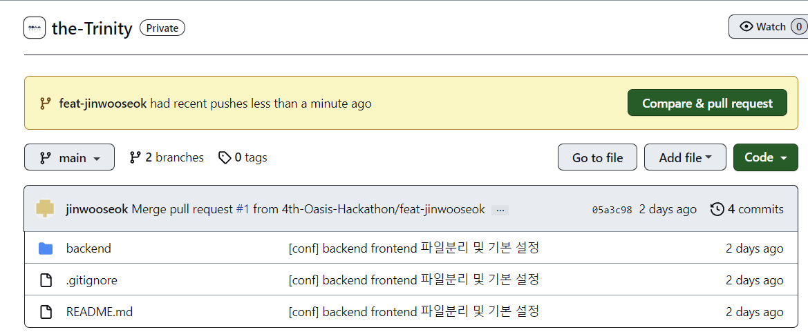
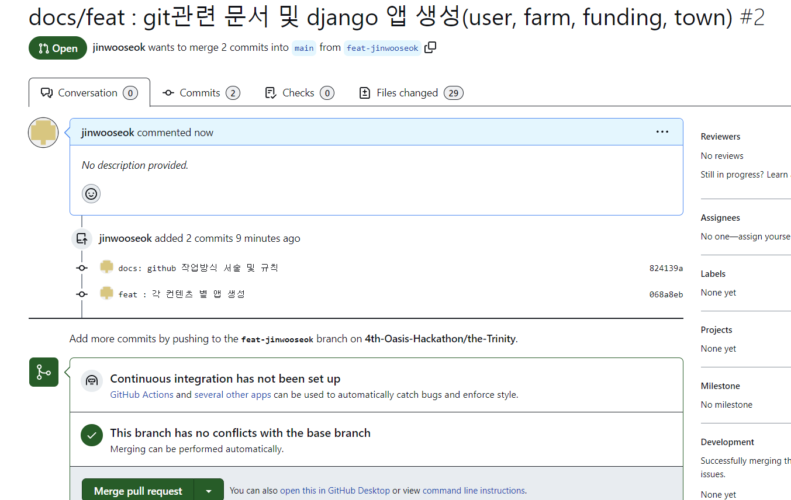

# the-Trinity
오아시스 해커톤 팀 '삼위일체'의 깃허브 레포지토리 입니다. 
## 0. 프로젝트 설명
> 미작성

## 1. commit prefix

### 1-1. 코드 관련

```
feat: 기능 개발 및 기능 수정
fix: 기존에 작성된 코드 오류 개선 혹은 버그 패치
refactor: 기존 코드 구조 개선
etc: 주석 추가, 코드 살짝 변경 등 영향을 미치지 않는 수정
```

### 1-2. 기타 작업 관련

```
docs: 문서 수정 
test: test 작업 개발 및 수정
conf: 환경설정 수정
build: 빌드 관련
init: 프로젝트 생성 후 첫 커밋
merge: pull 충돌 수정
```

### 1-3. 파일 관련

```
rename: 파일 이름 및 변수명 변경
delete: 파일 삭제
move: 파일 위치 이동
```

### 1-4. 플랫폼 및 라이브러리 추가

```
add: 개발 편의성, 새로운 라이브러리 등 도입
```

<br>

## 2. GIT 명령어

협업하면서 필요한 명령어. <>는 이해를 돕기 위해 추가한 것이므로 제거하고 사용.

> e.g. <브랜치_이름> -> 브랜치_이름

### 2-0. Pull
main브랜치를 자신의 컴퓨터의 저장소로 불러오는 과정이다. main브랜치는 항상 최신 데이터를 유지하고 있는게 좋기 때문에 누군가가 데이터를 pr하여 업데이트 했다면 이 명령어를 실행해 최신 데이터인 main브랜치와 업데이트 되지않은 자신의 로컬 저장소를 동기화한다.
<div align="center" style="color:red;">
    <strong>!!main 브랜치 코드가 변경된 경우 꼭 본인의 분기와 동기화 시켜줘야 함!!</strong>
</div>

<br>

```
git pull origin main
```

### 2-1. Clone

```
git clone <git 주소> --branch <branch 이름>
```

### 2-2. 현재 작업환경 확인

해당 작업은 필수는 아님. 정상적으로 push나 pull을 할 수 없는 경우 원인 확인용도로 사용하면 됨.

```
# 현재 작업 branch 확인 (본인 branch 이름이 출력되면 정상)
git branch

# 연결 remote 확인 (origin만 연결되어 있으면 됨)
git remote -v

# git config list 확인 (user.name, user.email등이 제대로 저장되어 있는지 확인)
git config -l

# 간혹 user.name과 password를 입력하라고 하는 경우 git config에 credential.helper를 store로 바꾸어 놓으면 됨
git config user.credential store
```

### 2-3. commit과 push

```
git add *
git commit -m "prefix : 커밋메시지 입력"
git push origin <본인 branch 이름>
```

### 2-4. Pull requests

본인의 브랜치에 commit과 push과정을 거쳤다면 이제 main 브랜치에 pull request를 보내 기존의 데이터와 통합한다. 이때부터는 git이 아닌 github 웹페이지로 이동한 후에 자신의 브랜치에서 진행을 한다.

위와 같은 화면에서 compare&pull request를 클릭한 후

위와 같은 화면에서 code change를 확인 후 merge pull request버튼을 클릭한다. 혹은 타인의 검토를 받는게 좋은 경우에는 타인의 리뷰를 기다린다.